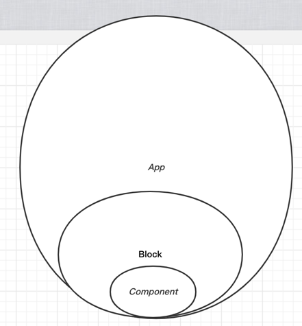

# metadata-generator
Implement the ui for user visual operation and generate user actions as metadata(JSON)

## Architecture

## Component-block-app-relation
- Component is the smallest unit
- Component makes up the block, 
- Block makes up the app

## File structure
- src
  - blocks (store built-in block)
  - views
    - blocks-view (user can select built-in blocks in this area and can move them to editor area,which is located on the left side of the page)
    - core-editor-view (the main area where user operate these blocks, which located on the center side of the page)
    - attribute-editor-view (edit selected block attributes,which is located on the right side of the page)
    - operation-view (user can do some operations like redo, revocation, publish app and so on,which is located on the top side of the page)
